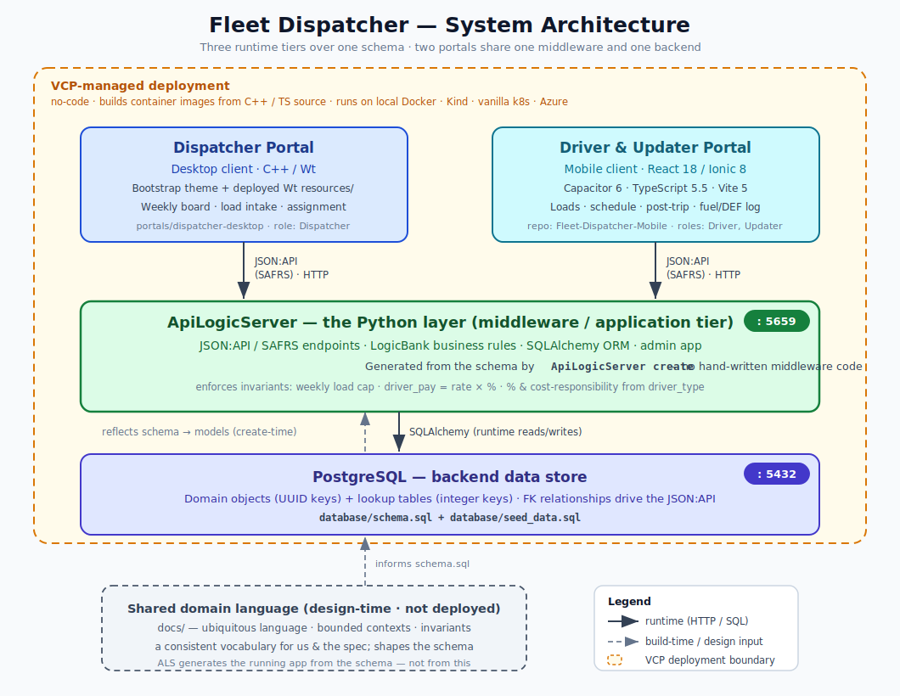

# Architecture

Fleet Dispatcher is a **three-tier** system. Two (or more) portals share a
single middleware and a single backend.



> Deployment: every server component ships a systemd unit — see
> [`../deploy/README.md`](../deploy/README.md).

## Tiers

### 1. Clients (presentation)

| Portal              | Audience            | Tech                                                            |
| ------------------- | ------------------- | -------------------------------------------------------------- |
| Dispatcher (desktop)| Dispatchers         | C++ with the [Wt](https://www.webtoolkit.eu/wt) framework      |
| Mobile              | Drivers & Updaters  | React 18 · Ionic 8 · Capacitor 6 · TypeScript 5.5 · Vite 5     |

Clients never talk to PostgreSQL directly. Every read/write goes through the
JSON:API exposed by ApiLogicServer.

### 2. Middleware (application + API)

[**ApiLogicServer**](https://apilogicserver.github.io/Docs/) exposes the domain
as a **JSON:API** via **SAFRS**, and enforces business rules declaratively with
**LogicBank**. It maps the PostgreSQL schema to SQLAlchemy models and serves
them on **port 5659** (configurable via `API_PORT`).

- **JSON:API / SAFRS** — resource endpoints, filtering, sorting, pagination,
  relationship navigation, and an OpenAPI/Swagger surface, generated from models.
- **LogicBank** — declarative, spreadsheet-like rules (sums, counts, formulas,
  constraints) that keep domain invariants true on every transaction. This is
  where invariants such as *"a driver may hold at most 4 loads in a dispatch
  week"* and *"driver pay = rate × contract percentage"* live at the persistence
  boundary.

### 3. Backend (persistence)

**PostgreSQL** on **port 5432** (configurable via `DB_PORT`) is the system of
record. The schema in `database/schema.sql` is the physical realization of the
domain model.

## Ports & configuration

All ports and credentials are configurable through environment variables; see
[`.env.example`](../.env.example).

| Variable        | Default                  | Purpose                          |
| --------------- | ------------------------ | -------------------------------- |
| `DB_HOST`       | `localhost`              | PostgreSQL host                  |
| `DB_PORT`       | `5432`                   | PostgreSQL port                  |
| `DB_NAME`       | `fleet_dispatcher`       | Database name                    |
| `DB_USER`       | `fleet`                  | Database user                    |
| `DB_PASSWORD`   | `fleet`                  | Database password                |
| `API_PORT`      | `5659`                   | ApiLogicServer JSON:API port     |
| `DATABASE_URL`  | derived from the above   | SQLAlchemy / psql connection URL |

## Why this shape

ApiLogicServer is **database-first**: it generates the API and ORM directly from
the schema. So there are only two artifacts to keep aligned, both speaking the
same ubiquitous language:

1. `docs/domain-model.md` — the model in prose: bounded contexts, aggregates,
   invariants, and the shared vocabulary we use when talking about the app.
2. `database/schema.sql` — that model made physical (tables, lookups, FK
   relationships, CHECK constraints). ApiLogicServer generates the running
   middleware from it.

Keeping the prose and the schema in sync — same nouns, same rules — is what
makes this a domain-led project rather than CRUD-over-tables. The ubiquitous
language is also how we communicate: consistent terms keep design discussions
unambiguous.

## Request flow (example: dispatch a load)

```
Dispatcher portal ──POST /api/Load (JSON:API)──▶ ApiLogicServer
                                                   │
                                 LogicBank rules:  ├─ load count ≤ 4 / week
                                                   ├─ equipment compatible
                                                   └─ rate ≥ 0
                                                   │
                                                   ▼
                                              PostgreSQL  (INSERT load)
                                                   │
Dispatcher portal ◀──201 + resource──────────────┘
```

The mobile app subscribes to the same resources (e.g. a driver sees their own
loads for the current dispatch week) through the identical JSON:API.
